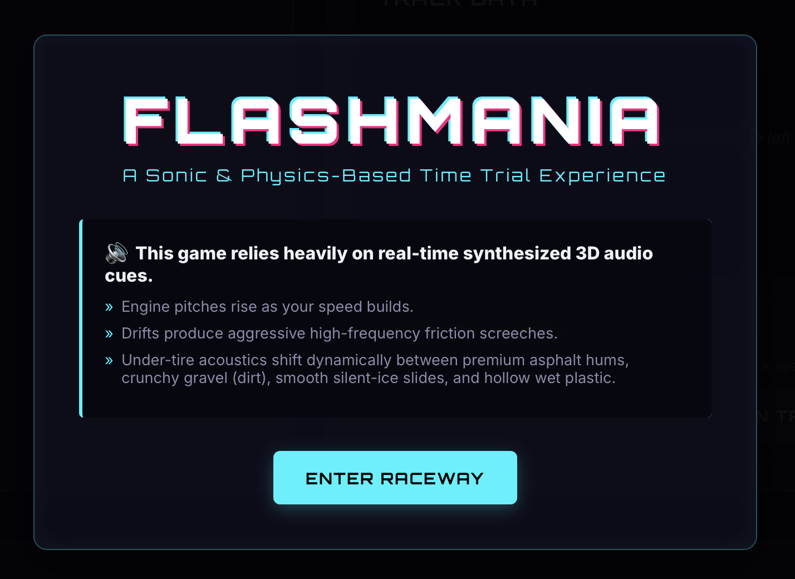
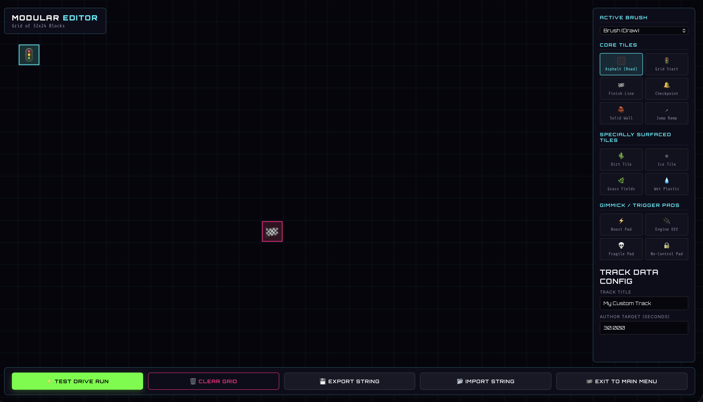
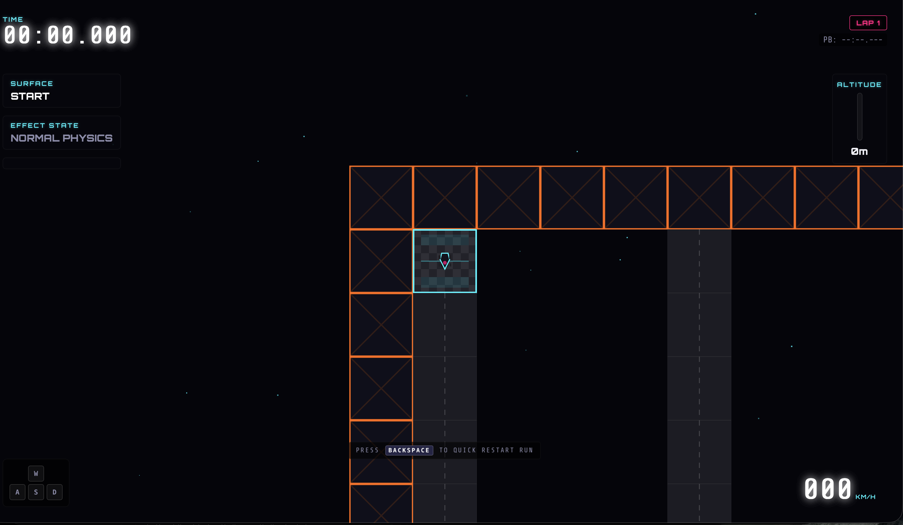
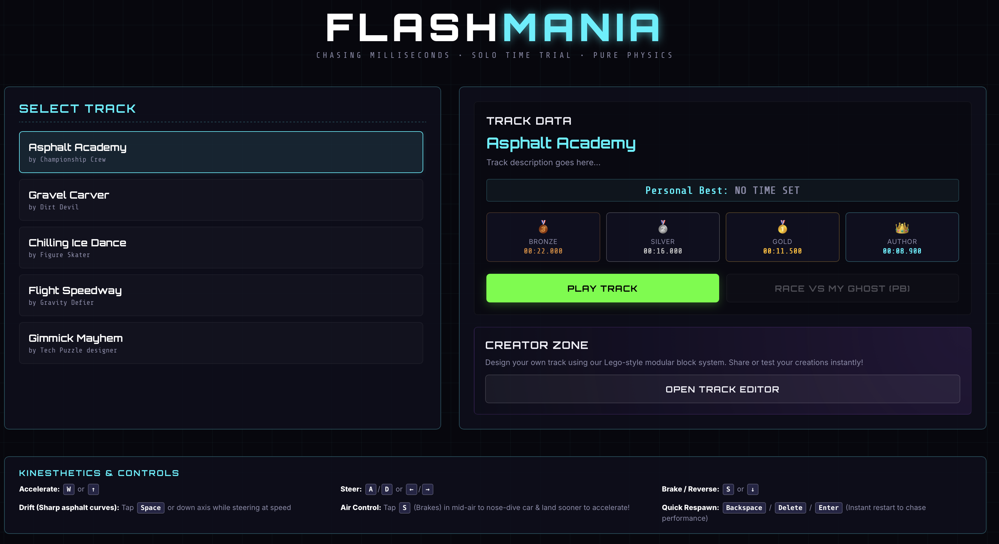

# Flashmania

This repository is a side-by-side comparison of how different AI coding models tackle the exact same task. Each branch contains a version of the game built by a different model, working from an identical prompt sequence and the same coding harness, [swival.dev](https://github.com/swival/swival).

## The experiment

Every model received the same two prompts, in two distinct sessions:

1. *"In a markdown file, accurately describe the game Trackmania to someone who doesn't know the game at all, and is blind."*
2. *"/goal Implement this in TypeScript."*

That's it. No follow-ups, no nudges, no hand-holding. The first prompt produces [flashmania_description.md](./flashmania_description.md), the design document the model writes for itself. The second asks the model to turn that document into a working TypeScript game. The harness handles tool use, file editing, and the agent loop; everything else is on the model.

The point isn't to crown a winner. It's to see how different models interpret an open-ended brief, where they invest their effort, what they leave out, and what kind of code they produce when nobody is steering.

Full agent traces for the original run are [available on Hugging Face](https://huggingface.co/datasets/jedisct1/agent-traces-flashmania).

## Branches

Each branch below is an independent attempt at the same task. Check them out and run them to see what each model produced.

- [`main`](https://github.com/dip-proto/flashmania/tree/main) — Gemini 3.5 Flash
- [`gpt5`](https://github.com/dip-proto/flashmania/tree/gpt5) — GPT-5
- [`ds4`](https://github.com/dip-proto/flashmania/tree/ds4) — DeepSeek 4 Flash
- [`glm-5.1`](https://github.com/dip-proto/flashmania/tree/glm-5.1) — GLM 5.1
- [`qwen3.6-27b`](https://github.com/dip-proto/flashmania/tree/qwen3.6-27b) — Qwen 3.6 27B
- [`minimax`](https://github.com/dip-proto/flashmania/tree/minimax) — MiniMax M2.7
- [`mimo`](https://github.com/dip-proto/flashmania/tree/mimo) — MiMo v2.5 Pro

## Screenshots

These are from the `main` branch.

  

  

  

  

